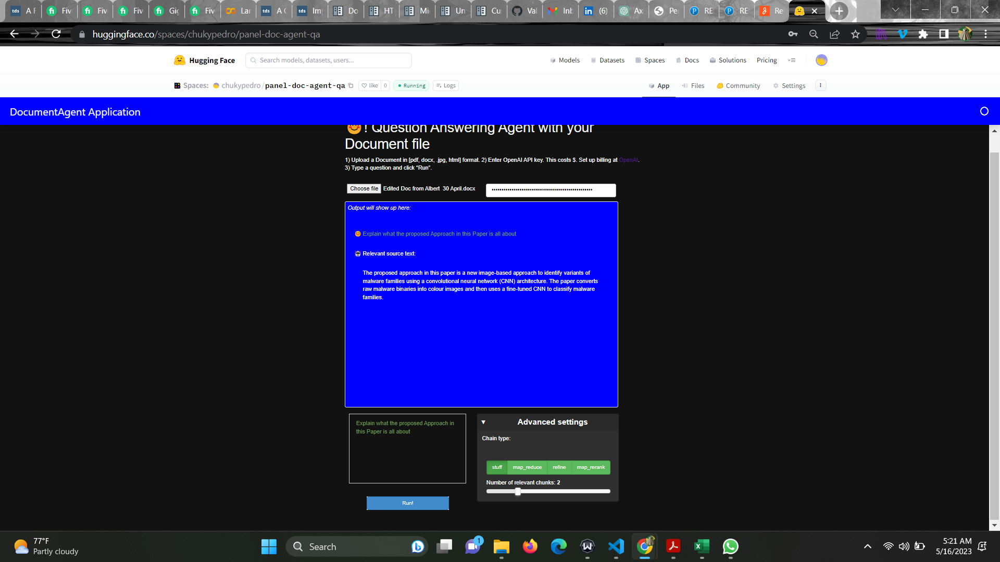

Check out the configuration reference at https://huggingface.co/docs/hub/spaces-config-reference

## Large Languange Model Powered App.

Document QA app powered by an LLM agent. You can upload any file in DOCX, PDF, and JPG formats and input your API key. Ask any questions related to the file, and you will receive an output.

 
  <kbd>
    
  </kbd>

